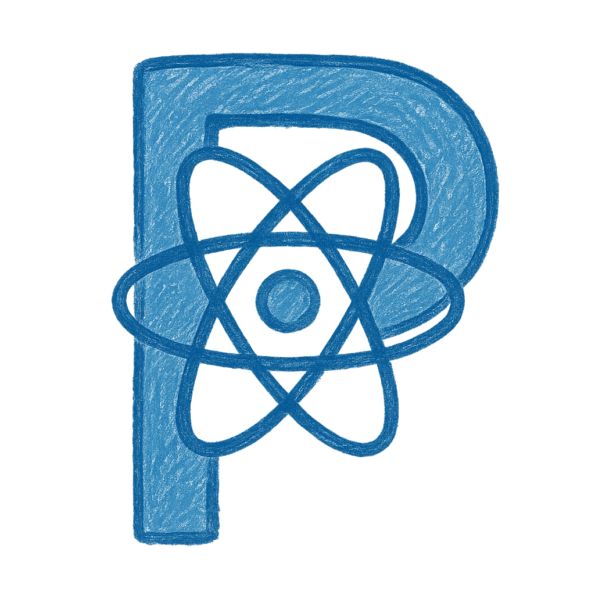

<p align="center">
  <a href="https://hacker0limbo.github.io/react-papercss-design" target="_blank">
    
  </a>

  <h3 align="center">React PaperCSS Design</h3>

  <div align="center">

[](https://www.npmjs.com/package/react-papercss-design)  [](https://github.com/hacker0limbo/react-papercss-design/blob/master/LICENSE)

  </div>

</p>

简体中文 | [English](./README.md)

React PaperCSS Design 是一个基于 [PaperCSS](https://getpapercss.com) 的 UI 组件库

## 🎉 特性

- 开箱即用的高质量 React 组件
- 使用 TypeScript 开发，提供完整的类型定义文件
- UI 和 API 和原生的 PaperCSS 保持一致

## 📦 安装

请注意 React PaperCSS Design 并不会内置 PaperCSS, 因此需要一并安装 PaperCSS

```shell
npm i papercss react-papercss-design
```

```shell
yarn add papercss react-papercss-design
```

## 使用

```tsx
import 'papercss/dist/paper.min.css';
import React from 'react';
import { Button } from 'react-papercss-design';

const App: React.FC = () => {
  return <Button>Hello React PaperCSS Design</Button>;
};

export default App;
```

## 贡献

欢迎任何愿意参与贡献的参与者, 请阅读 [CONTRIBUTING](./CONTRIBUTING.md) 获取更多信息

## 鸣谢

该项目受到如下启发:

- [PaperCSS](https://getpapercss.com)
- [Spaper](https://oli8.github.io/spaper/)

## 开源协议

本项目遵守 [MIT 协议](./LICENSE),
